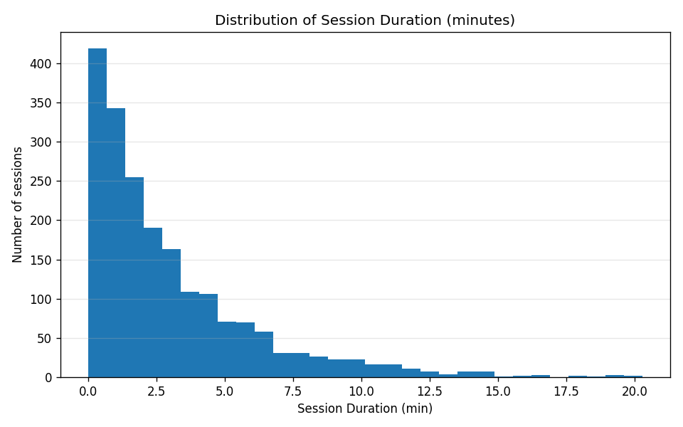
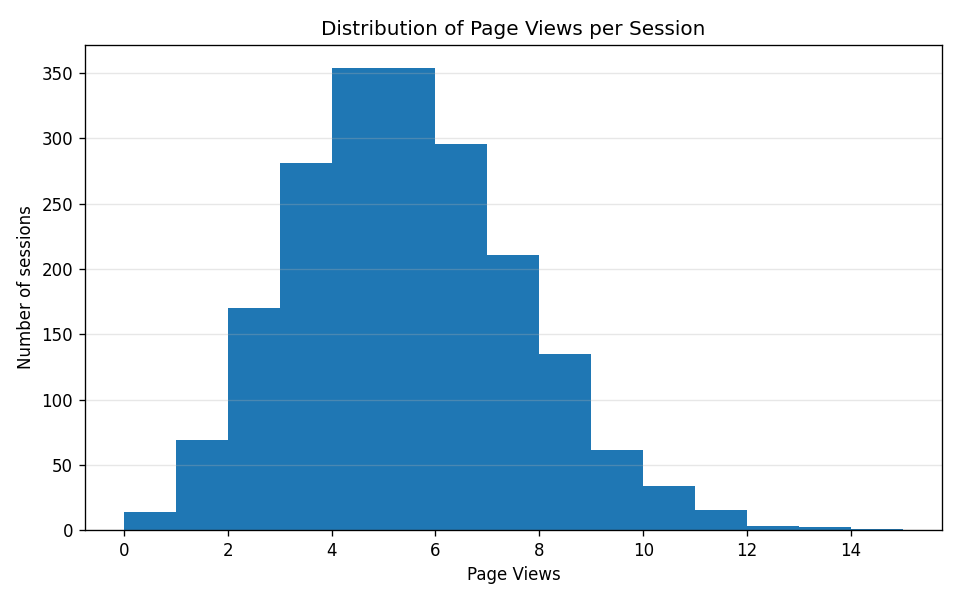

# Web Analytics Mini-Project — Website Traffic, Sessions & Conversion 

This mini-project uses a simulated web analytics dataset to explore how **traffic source** and **user behavior** relate to **session quality** and **conversion probability**.  

The focus is not only on “who wins” in terms of averages, but also on:
- how **distributions** behave (long tails, skew),
- when **mean vs median** tell different stories,
- and how easy it is to **over-interpret tiny differences**.

---

## Dataset

- **Name:** “Website Traffic”  
- **Source:** [Kaggle — Website Traffic (Anthony Therrien)](https://www.kaggle.com/datasets/anthonytherrien/website-traffic)  
- **Granularity:** each row represents a **single session** (not a unique user and not aggregated by day).

> 💡 **Important:**  
> The dataset is **simulated**, and the `Conversion Rate` column is a **continuous value between 0 and 1 at the session level**. In this project it is interpreted as a **conversion probability / score per session**, not as a strict binary “converted / did not convert” flag.

---

## Repository structure / Notebooks

- **Notebook 01 — [Session Overview (EDA)](notebooks/01_session_overview_eda.ipynb)**  
  First-pass exploration of distributions (session duration, page views, etc.), long tails, and early relationships like **Page Views vs Session Duration** and **mean vs median** comparisons.

- **Notebook 02 — [Cleaning & Analysis Prep](notebooks/02_cleaning_and_analysis_prep.ipynb)**  
  Creation of a cleaned working dataset (`df_clean`), basic data-quality checks, and construction of grouped views that are later used for “business-style” interpretations (by traffic source, previous visits, and duration bands).

---

## Key questions

This project tries to answer a few practical questions an analyst might face when looking at session-level web data:

1. **How are core metrics distributed?**  
   - Session Duration  
   - Page Views  
   - Conversion probability (`Conversion Rate`)  
   Is there a **long tail** of very unusual sessions?

2. **When do mean and median diverge, and why does it matter?**  
   - Are averages inflated by a small number of extreme sessions?  
   - Does the **median** give a more realistic picture of a “typical” session?

3. **How do Traffic Sources differ?**  
   - Which channels bring **more sessions**?  
   - Which channels bring **slightly better sessions** (longer, more engaged, slightly higher conversion probability)?

4. **Does prior exposure (Previous Visits) change behavior or conversion probability?**  
   - Are **loyal users** really much more likely to convert, or only a bit?

5. **Do longer sessions convert better?**  
   - Is there a strong link between **Session Duration** and conversion probability, or only a weak one?

6. **What are the risks of over-interpreting small differences?**  
   - When do we have a real pattern vs. “noise with a story”?

---

## Variables

Core variables used in this project:

- **Page Views** — integer count of pages viewed in the session.  
- **Session Duration** — continuous, in minutes.  
- **Bounce Rate** — continuous, proportion (0–1).  
- **Traffic Source** — categorical (e.g. Organic, Social, Referral, Direct, etc.).  
- **Time on Page** — continuous, similar scale to Session Duration.  
- **Previous Visits** — integer count of prior visits from the same user before this session.  
- **Conversion Rate** — continuous (0–1), interpreted here as a **per-session conversion probability/score**, not a binary outcome.

---

## Cleaning notes

- Removed a small number of sessions with **`Page Views = 0`** (n = 14).  
  **Rationale:** a “session” with zero page views is likely a tracking artifact rather than real on-site behavior, and keeping them can slightly distort summary metrics and grouped averages.

- Basic checks performed in the notebook:
  - Consistency of `Session Duration` vs `Time on Page` (they are strongly correlated, as expected).  
  - Missing values and duplicated rows for the main analytical columns.  
  - Range and uniqueness checks for `Conversion Rate` and `Bounce Rate`.

---

## Key findings (so far, WIP)

### 1. Session behavior and distributions

- **Session Duration** is **heavily right-skewed**:  
  - many short sessions (often under ~2 minutes),  
  - plus a **long tail** of relatively rare, very long sessions.  
  - This means the **mean duration** is pulled upward by a few long sessions and does **not** represent a “typical” session very well.

- **Page Views** is more concentrated:  
  - most sessions cluster around **4–6 pages**,  
  - with fewer extremely high values.  
  - Here, the mean and median are much closer, so both are more representative.

> 📌 Interpretation:  
> For duration, the **median** is a better summary of a “typical” session than the mean. For page views, mean and median are both reasonable.

---

### 2. Page Views vs Session Duration

We grouped sessions by **Page Views** and looked at **Session Duration** statistics for each group:

- From **1 to 5 page views**, the **average and median session duration increase** with page views.  
  This matches intuition: if you visit more pages, you tend to spend more time.

- Beyond ~5 page views, the number of sessions per group **drops quickly**.  
  With very few sessions (e.g. 12–14 pages), the average duration becomes **unstable** and highly sensitive to single sessions.

> 📌 Interpretation:  
> There is a **positive relationship** between page views and session duration for the bulk of sessions (1–5 pages). For very high page-view counts, the sample size is too small to draw strong conclusions.

---

### 3. Traffic Source summary (business-friendly view)

Using a grouped table by `Traffic Source`, we compare:

- number of sessions (volume),
- median session duration (typical engagement),
- median page views,
- and mean conversion probability.

High-level summary:

- **Organic**  
  - Drives the **largest share of sessions**.  
  - Shows **solid, typical engagement** (median duration and page views slightly above or close to other channels).  
  - Acts as the **baseline** traffic source: large volume, good but not exceptional conversion probability.

- **Social**  
  - Typically contributes **less volume** than Organic.  
  - Sessions from Social tend to have **slightly longer median duration**, suggesting users spend a bit more time exploring.  
  - Conversion probability is **similar** to other sources — no strong conversion boost.

- **Referral**  
  - Lower volume overall.  
  - Does not stand out for very long sessions.  
  - Shows a **slightly higher average conversion probability** than other sources,  
    but this advantage is **small** and based on a smaller number of sessions.

> 📌 Interpretation:  
> - Organic is crucial for **volume**.  
> - Social brings sessions that are **slightly more engaged**.  
> - Referral shows a **small conversion edge**, but not a dramatic one, and only on a smaller sample.  
> A responsible analyst would highlight these **small advantages** without overselling them as “game changers”.

---

### 4. Impact of previous visits on user behavior

Sessions were segmented into three groups based on `Previous Visits`:

- `"0"`     → new users, first recorded visit  
- `"1–3"`   → light returning users  
- `"4–9"`   → highly loyal users (frequent returners)

For each group we compared:

- median session duration,
- median page views,
- mean conversion probability.

Findings:

- **No dramatic jump** between new and returning users.  
- New users tend to spend **slightly more time** on the site, which might reflect exploration and unfamiliarity with the interface.  
- Both new and returning users tend to view a **similar number of pages** per session.  
- The most loyal users (`4–9` previous visits) show a **slightly higher average conversion probability**, but the difference compared to other groups is **small**.

> 📌 Interpretation:  
> Loyalty (more previous visits) does not translate into a huge behavioral or conversion gap in this dataset. The effect exists, but it is **mild**, and other factors are likely just as important.

---

### 5. Do longer sessions convert better?

Sessions were grouped into duration bands using the **quartiles of `Session Duration`**:

- `very_short`  
- `short_mid`  
- `mid_long`  
- `long`

For each band we computed the **mean and median conversion probability**.

Findings:

- Longer sessions do show **slightly higher average conversion probability** than very short sessions.  
- However, the differences between duration groups are **small (centésimas / milésimas)**.

> 📌 Interpretation:  
> The relationship between session duration and conversion probability is **positive but weak**.  
> It would be misleading to say “if we just make sessions longer, conversion will improve dramatically”.  
> Session duration seems to help a bit, but it is **not** a magic lever.

---

### 6. Is organic traffic really our “best” traffic?

If we judge performance only by **conversion metrics**:

- Organic is the **largest source of sessions**.  
- Its **average conversion probability** is **not higher** than that of referral traffic.  
- Referral shows a **slight conversion advantage**, but on a smaller volume of sessions.

> 📌 Interpretation:  
> Organic is **essential for scale**, but not necessarily “the best” in terms of conversion quality.  
> A balanced view would treat Organic as the core acquisition channel, with **Referral** as a niche source that performs slightly better on conversion, but with limited volume.

| traffic_source   |   sessions |   median_session_duration_min |   median_page_views |   mean_conversion_prob |
|------------------|------------|-------------------------------|---------------------|------------------------|
| Direct           |        215 |                       1.8877  |                   5 |               0.97858  |
| Organic          |        783 |                       2.08968 |                   5 |               0.982401 |
| Paid             |        423 |                       1.76871 |                   5 |               0.980853 |
| Referral         |        298 |                       1.98821 |                   5 |               0.987829 |
| Social           |        267 |                       2.27238 |                   5 |               0.982833 |

---

### 7. Overall takeaway from the dataset

Overall, this simulated dataset only shows **weak relationships** between conversion probability and simple behavioral metrics like:

- session duration,  
- pages viewed,  
- and previous visits.

There is no clear evidence that conversion probability **strongly depends** on any single one of these variables. This suggests that:

- other factors (not included here) — such as **landing page content**, **offer type**, **device**, or **user intent** — are likely just as important or more important, and  
- in real projects, analysts should be careful not to over-interpret **tiny differences** in aggregates as big strategic levers.

---

## Why this dataset is still useful

Even though the dataset is simulated and the conversion signal is weak, working with it is valuable for several reasons:

1. **Practice with real-world patterns**  
   - Long-tailed distributions  
   - Skewed metrics where mean vs median diverge  
   - Small group sizes at the extremes and the risk of over-interpreting them

2. **Developing analytical judgment**  
   - Learning to say “the effect exists, but it’s small” instead of forcing a dramatic story.  
   - Distinguishing between **direction** (positive/negative relationships) and **strength** (weak vs strong effects).

3. **Building communication skills**  
   - Translating technical tables (`groupby`, `agg`, correlations) into **business-friendly narratives** for traffic sources, user behavior, and conversion.  
   - Explicitly stating limitations (simulated data, no binary conversion flag, missing context variables).

4. **Portfolio readiness**  
   - The code and README together show:
     - data cleaning decisions,  
     - sensible grouping and segmentation,  
     - cautious interpretation of metrics,  
     - and clear communication of findings and limitations —  
     which are exactly the skills expected from an entry-level data/analytics profile.

---

## How to run

1. **Clone** this repository.  
2. Create a virtual environment and install dependencies:
   ```bash
   pip install -r requirements.txt


---

## Notes
This project is complete for its current scope, but can be extended with more realistic datasets and additional features. The emphasis is on:

* clarity of analysis,

* reproducibility (clean, documented notebook),

* sand honest, business-oriented communication of what the data does — and does not — support.

---
### Example visuals

Session duration distribution:



Page views per session:


